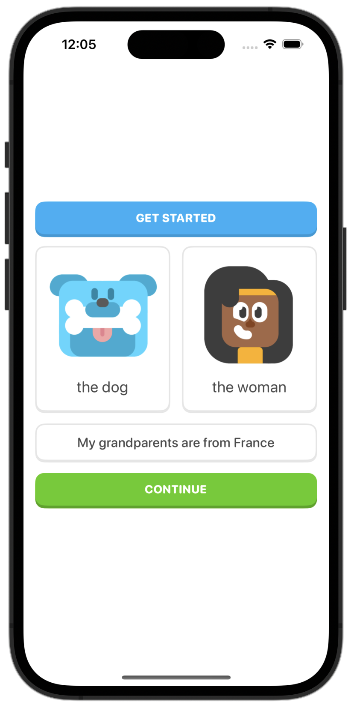
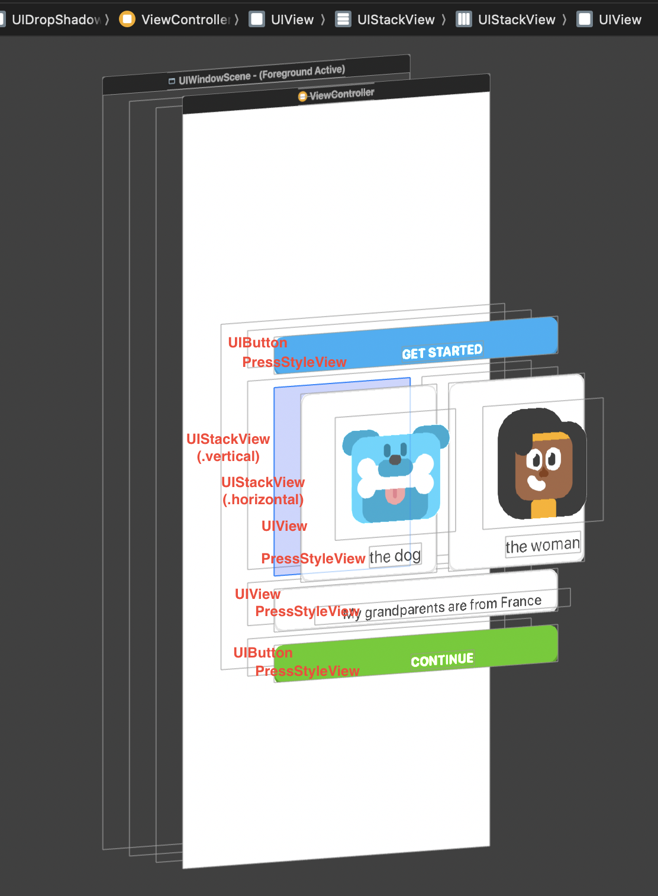

# Press Style - AKA the Duolingo Style Button

This style can be applied to any `UIView`, including `UIButton`. It features a smooth press animation using `CGAffineTransform` to create a responsive interaction. A custom `CALayer` manages the shadow, which is hidden during the press and restored afterward. The style also includes corner rounding and customizable shadow and border properties. A `UILongPressGestureRecognizer` is used to handle the tap, with support for optional feedback and custom actions.

    &nbsp;&nbsp;
     

